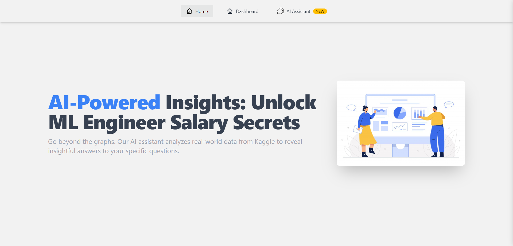
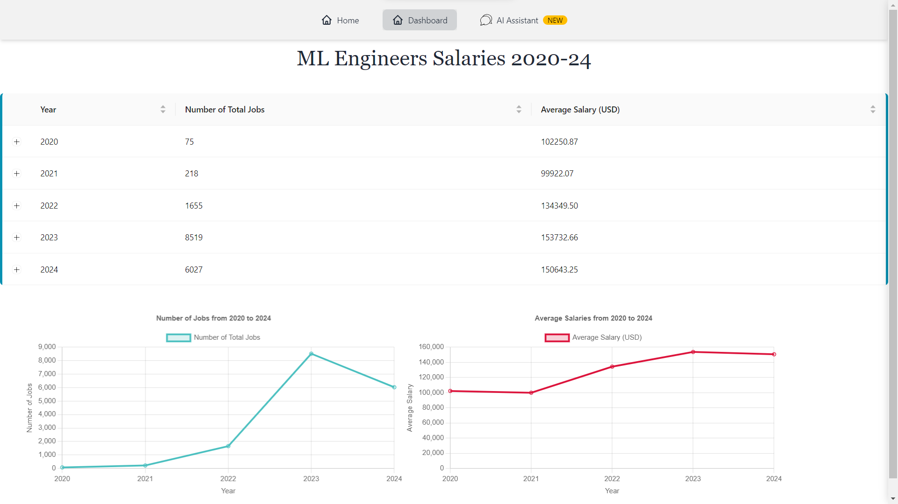
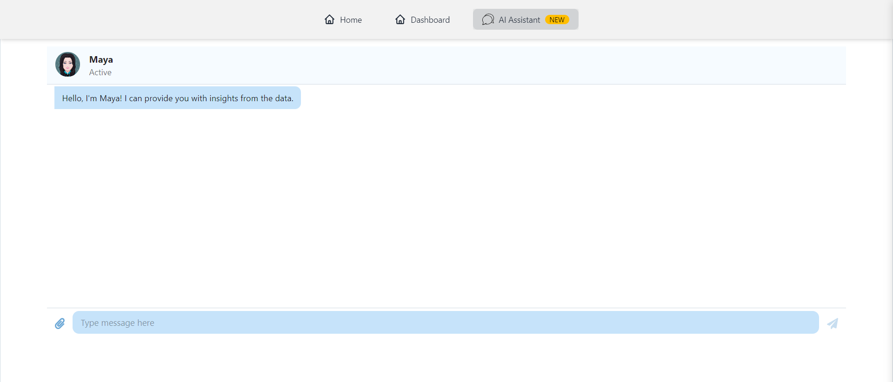

# TO-DOs
- [x] Task 1 : Table with sorting feature in
- [x] Task 2a : Graph visualization for data
- [x] Task 2b : Nested Tables, Row Expansion
- [x] Task 3 : Chatbot(OpenAI API)

# Features
- Main Table with sorting feature in all columns
- Nested Tables, Row Expansion
- Line Graph Visualization for data
- Chatbot using OpenAI API
- Responsive Design

# Tech Stack
- ReactJS
- Tailwind CSS
- Ant Design
- DaisyUI
- ChartJS
- OpenAI API

# Installation
1. Clone the repository
2. Run `npm install` to install the dependencies
3. Run `npm run dev` to start the development server
4. Open `http://localhost:{$port}` in your browser
5. Enjoy the app!

# Screenshots

